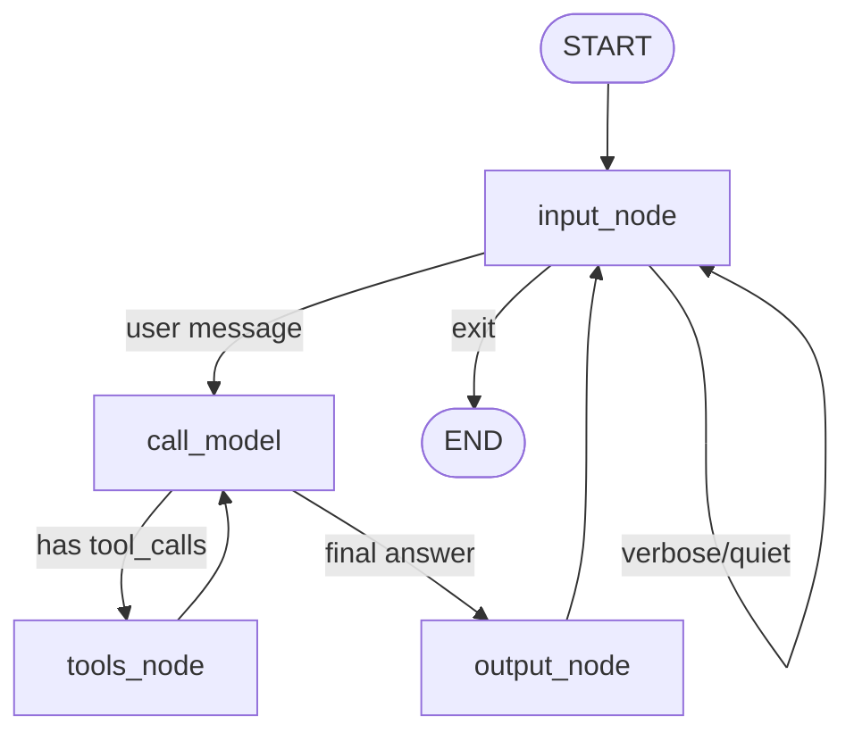

# Topic3Tools — Agent Tool Use

This directory contains solutions for Topic 3: Agent Tool Use from the Agentic AI Spring 2026 course (CS 6501, University of Virginia).

The goal is to connect an LLM-driven agent to external tools (local and API-based), then integrate tool calling into a LangGraph control-flow program.


## Table of Contents

| File | Description |
|------|-------------|
| **Task scripts** | |
| `task1_ollama_timing.py` | Python timing wrapper for Ollama evals |
| `task2_openai_gpt4o_mini_test.py` | OpenAI GPT-4o-mini connectivity test |
| `task3_manual_calculator_tool.py` | Manual tool handling with calculator (geometric functions) |
| `task4_langgraph_tools_basic.py` | LangGraph agent (from langgraph-tool-handling.py) with calculator, count_letter, reverse_words |
| `task4_multi_tool_demo.py` | Task 4 multi-tool query demonstrations |
| `task5_langgraph_persistent_conversation.py` | Task 5: Persistent conversation with checkpointing |
| `task7_parallelization_discussion.txt` | Task 6: Parallelization opportunities (no code) |
| **Ollama MMLU evals** | |
| `llama_mmlu_eval1.py` | HuggingFace eval (astronomy) |
| `llama_mmlu_eval2.py` | HuggingFace eval (business_ethics) |
| `llama_mmlu_eval1_ollama.py` | Ollama eval (astronomy) |
| `llama_mmlu_eval2_ollama.py` | Ollama eval (business_ethics) |
| `run_timed_evals.sh` | Sequential timing for HuggingFace evals |
| `run_ollama_timing.sh` | Sequential and parallel timing for Ollama evals |
| **Output files** | |
| `1_output_ollama_timing.txt` | Task 1 run instructions |
| `1_output_ollama_timing_live.txt` | Task 1 actual run results (sequential + parallel) |
| `2_output_gpt4omini.txt` | Task 2 run instructions |
| `2_output_gpt4omini_live.txt` | Task 2 actual run output |
| `3_output_calculator.txt` | Task 3 run instructions |
| `3_output_calculator_live.txt` | Task 3 actual run output |
| `4_output_langgraph_tools.txt` | Task 4 run instructions |
| `4_output_langgraph_tools_live.txt` | Task 4 actual run output (multi-tool traces) |
| `5_output_persistent_conversation.txt` | Task 5 Mermaid diagram, examples, recovery |
| **Other** | |
| `requirements.txt` | Python dependencies |


## Requirements

```bash
pip install -r requirements.txt
```

You also need:
- **Ollama** installed and running (for Task 1)
- **OPENAI_API_KEY** exported (for Tasks 2–5)


## Environment Setup

**OpenAI** (Tasks 2–5):
```bash
export OPENAI_API_KEY="your_key_here"
```
Or add to `~/.profile` and source it.

**Ollama** (Task 1):
```bash
ollama pull llama3.2:1b
ollama serve   # in a separate terminal
```


## Task 1 — Ollama Setup and Timing

**Observed Results** (from `1_output_ollama_timing_live.txt`):

| Mode | Real Time | Astronomy | Business Ethics |
|------|-----------|-----------|-----------------|
| Sequential | **1m 12.2s** | 56/152 (36.84%) | 47/100 (47.00%) |
| Parallel | **0m 45.2s** | 57/152 (37.50%) | 47/100 (47.00%) |

**Observations:**

- **Sequential** (`time { python prog1 ; python prog2 }`): Total wall-clock time ≈ 72 seconds. Each process runs one after the other; astronomy (~40s) then business_ethics (~27s).
- **Parallel** (`time { python prog1 & python prog2 & wait }`): Total wall-clock time ≈ 45 seconds. Both processes run concurrently, sharing the same Ollama server. **Speedup: ~1.6×** (72s → 45s).
- Parallel execution is faster because the two evals overlap in time. With multiple GPUs (e.g., RTX A6000 + RTX A5000), Ollama can serve both requests concurrently.
- The `real` time from the shell `time` command is wall-clock elapsed time. The `user` time (CPU) is lower in parallel because the processes share GPU compute.

**Run:**
```bash
./run_ollama_timing.sh
# or
time { python llama_mmlu_eval1_ollama.py ; python llama_mmlu_eval2_ollama.py }
time { python llama_mmlu_eval1_ollama.py & python llama_mmlu_eval2_ollama.py & wait ; }
```


## Task 2 — OpenAI GPT-4o-mini Test

**Observed Output** (from `2_output_gpt4omini_live.txt`):
```
Success! Response: Working!
Cost: $0.000005
```

**Explanation of the two key lines:**

- **`client = OpenAI()`** — Creates an OpenAI client. By default it reads `api_key` from the `OPENAI_API_KEY` environment variable, so the key stays out of source code and is not committed.
- **`response = client.chat.completions.create(...)`** — Sends a chat completion request to the API with the given model, messages, and `max_tokens`. Returns the model’s response and usage metadata.

**Run:**
```bash
export OPENAI_API_KEY="your_key"   # if not already set
python task2_openai_gpt4o_mini_test.py
```


## Task 3 — Manual Calculator Tool (manual-tool-handling.py)

Based on **manual-tool-handling.py** (raw OpenAI API, not LangChain). Adds a calculator tool with geometric functions.

**Observed Output** (from `3_output_calculator_live.txt`):

| Test | Input | Tool Call | Result |
|------|-------|-----------|--------|
| 1 | sin(π/2) | calculator | 1.0 |
| 2 | sqrt(144) | calculator | 12.0 |
| 3 | Weather in Tokyo | get_weather | Clear, 65°F |
| 4 | cos(0) + sqrt(9) | calculator (×2) | 1.0 + 3.0 = 4.0 |

The LLM correctly used the calculator tool for all math queries (no need for forcing strategies).

- Calculator uses `json.loads` to parse input and `json.dumps` for output.
- Supports arithmetic and geometric functions: `sin`, `cos`, `tan`, `sqrt`, `log`, `exp`, `pi`, `e`.
- If the LLM does math itself instead of using the tool, try: stronger system prompts (“Always use the calculator”), `tool_choice="required"` for math queries, or a validation node that checks for numeric answers without tool calls.


## Task 4 — LangGraph Tool Handling (langgraph-tool-handling.py)

Based on **langgraph-tool-handling.py** (LangChain). Adds:
1. **Calculator** (from Task 3) — Arithmetic and geometric expressions.
2. **count_letter** — Count occurrences of a letter in text (e.g., “How many s’s in Mississippi riverboats?”).
3. **reverse_words** — Custom tool: reverse each word in a string.

Uses `tool_map = {tool.name: tool for tool in tools}` for dispatch (replaces if/else).


**Observed Output** (from `4_output_langgraph_tools_live.txt`):

| Query | Tools Used | Iterations |
|-------|------------|------------|
| Q1: How many s's and i's in Mississippi riverboats? | count_letter x2 | 2 |
| Q2: Are there more i's than s's? | count_letter x2 | 2 |
| Q3: Sin of (i's - s's) in Mississippi riverboats? | count_letter x2, then calculator | 3 |
| Q4: Reverse 'hello world', count l's, sqrt of count | reverse_words, count_letter, calculator | 3 |
| Q5: Step-by-step (s's, i's, difference, sqrt, reverse 'done') | count_letter x2, reverse_words, calculator x2 | 4 |

**Discussion:** Multiple tools per turn (Q1-Q5), chaining (Q3: count then calculator), all three tools (Q4), 4 iterations for Q5 (LLM batched calls, did not hit 5-turn limit).

**Run:**
```bash
python langgraph-tool-handling.py           # original sample (get_weather only)
python task4_langgraph_tools_basic.py      # interactive
python task4_multi_tool_demo.py            # batch multi-tool queries
```

## Task 5 — Persistent Conversation with Checkpointing

Single long conversation (no fresh start each turn). Uses LangGraph nodes and edges instead of a Python loop. Includes checkpointing and recovery.

- **Nodes:** input → call_model → tools (if tool_calls) or output → back to input
- **Checkpointing:** MemorySaver (in-memory) by default; SqliteSaver for persistent recovery
- **Tools:** calculator, count_letter, reverse_words (same as Task 4)

**Mermaid diagram:**



**Example: Tool use**

| Turn | User | Tools invoked | Assistant |
|------|------|---------------|-----------|
| 1 | How many s's in Mississippi? | count_letter | There are 4 s's in Mississippi. |
| 2 | What's the square root of that? | calculator (sqrt(4)) | The square root of 4 is 2. |

**Example: Conversation context**

The graph maintains a single long conversation; the LLM sees the full message history.

| User | Assistant |
|------|------------|
| How many i's in Mississippi? | There are 4 i's in Mississippi. |
| And s's? | There are 4 s's in Mississippi. *(infers "s's" from prior context)* |
| What's the difference? | The difference is 0. *(uses prior tool results: 4 − 4)* |

**Example: Recovery**

With SqliteSaver (`TASK5_SQLITE=1`), state is persisted to `.checkpoints/task5.db`. Interrupt with Ctrl+C, then run again with the same `TASK5_THREAD_ID` to resume; the full message history is restored.

**Run:**
```bash
# Interactive (MemorySaver, in-memory)
export OPENAI_API_KEY="your-key"
python task5_langgraph_persistent_conversation.py

# Persistent recovery across restarts
pip install langgraph-checkpoint-sqlite
export TASK5_SQLITE=1
export TASK5_THREAD_ID=my_conversation
python task5_langgraph_persistent_conversation.py
# Interrupt with Ctrl+C, then run again with same env to resume
```


## Task 6 — Parallelization Opportunity

**Question:** Where is there an opportunity for parallelization in your agent that is not yet being taken advantage of?

**Answer:**

**Parallel tool execution within a single turn.** When the LLM requests multiple tool calls in one response (e.g., "How many i's and s's in Mississippi?"), those tool calls are currently executed **sequentially** in a loop. They could be executed **in parallel** because they are independent—counting i's does not depend on counting s's. The same applies to any set of tool calls that have no data dependencies on each other. LangGraph's built-in `ToolNode` runs tool calls in parallel; our manual `tools_node` (in both Task 4 and Task 5) loops over `tool_calls` one by one.

**Other opportunities (less immediate):**
- **Pipelining:** Overlap LLM generation with tool warm-up (limited by not knowing which tools will be called until the LLM finishes).
- **Multi-tenant:** Run separate conversation threads in parallel (e.g., via asyncio or multiple workers).
- **Batch tool invocations:** When the same tool is called multiple times with different arguments, batch into vectorized or parallel execution if the tool supports it.

**Constraints:** If tool B needs the output of tool A, they must run sequentially (e.g., our "sin of difference" query: the two counts can run in parallel; the calculator must wait). LLM latency often dominates; parallelizing tool execution helps when multiple tools are called per turn.


## Running All Tasks

```bash
# Task 1 (Ollama must be running)
./run_ollama_timing.sh

# Task 2
python task2_openai_gpt4o_mini_test.py

# Task 3
python task3_manual_calculator_tool.py

# Task 4 (interactive)
python task4_langgraph_tools_basic.py

# Task 4 (batch multi-tool demo)
python task4_multi_tool_demo.py

# Task 5 (persistent conversation, interactive)
python task5_langgraph_persistent_conversation.py
```

Save outputs:
```bash
python task2_openai_gpt4o_mini_test.py 2>&1 | tee 2_output_gpt4omini_live.txt
python task3_manual_calculator_tool.py 2>&1 | tee 3_output_calculator_live.txt
python task4_multi_tool_demo.py 2>&1 | tee 4_output_langgraph_tools_live.txt
./run_ollama_timing.sh 2>&1 | tee 1_output_ollama_timing_live.txt
```
