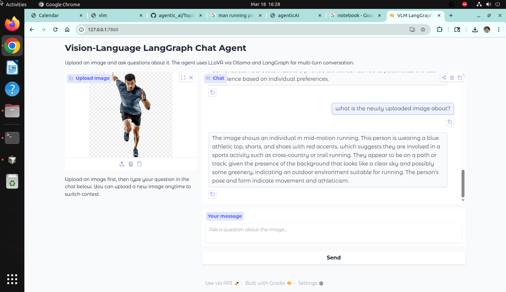

# Topic6VLM — Vision-Language Models (VLM)

This directory contains my work for Topic 6: Vision-Language Models (VLM) in Agentic AI Spring 2026 (CS 6501, University of Virginia).

Course reference:
https://www.cs.virginia.edu/~rmw7my/Courses/AgenticAISpring2026/Topic6VLM/vlm.html


## Overview

This topic focuses on building practical programs using a vision-language model (LLaVA) via Ollama, and structuring VLM-driven applications as agents with clean control flow (LangGraph-style).

Learning goals include:
- Understanding the basic VLM pipeline components (contrastive pretraining encoders, projection alignment, mixed image-language tokens).
- Building an agent that answers questions about uploaded images.
- Handling video input by extracting keyframes and sending them to a VLM.

(See the course page for details.)


## Requirements

Install dependencies (recommended to use a venv/conda env):

pip install -r requirements.txt

You will need:
- Ollama installed
- The llava model pulled
- Python packages:
  - ollama
  - langgraph / langchain (for the LangGraph agent exercise)
  - opencv-python (for the video exercise)

If you do not already have the model, pull it with:

ollama pull llava


## Repository Structure

This folder contains one program per required exercise, plus saved terminal outputs and a screenshot.

```
Topic6VLM/
├── exercise1_vlm_langgraph_chat_agent.py
├── Exercise2.py                    # Video surveillance agent
├── requirements.txt
├── outputs/
│   ├── exercise1_terminal_output.txt
│   ├── exercise2_terminal_output.txt
│   └── screenshot.png              # Screenshot of Exercise 1 Gradio interface
└── README.md
```


## Exercise 1 — Vision-Language LangGraph Chat Agent

File:
- exercise1_vlm_langgraph_chat_agent.py

Goal:
- Build a multi-turn chat agent that can hold a conversation about an uploaded image.
- Use good LangGraph structure and manage context carefully.
- If the program runs slowly, reduce the uploaded image resolution.

Implementation:
- **Gradio interface** (default): Web UI with image upload and chat. Run `python exercise1_vlm_langgraph_chat_agent.py`
- **CLI interface**: Text-based flow. Run `python exercise1_vlm_langgraph_chat_agent.py --cli`
- Uses Ollama + LLaVA (`llava:latest`) for vision-language inference
- LangGraph pipeline: add_user_message → call_vlm → trim_history
- Image handling: loads from file path immediately, clears conversation on new image upload

### Screenshot




## Exercise 2 — Video-Surveillance Agent

File:
- Exercise2.py

Goal:
- Use LLaVA indirectly on video by extracting frames and running a per-frame prompt.
- Create a ~2-minute video clip of an empty space where a person enters and exits at some point.
- Split the video into frames spaced ~2 seconds apart (using OpenCV).
- Run through frames with a prompt asking whether a person is present.
- Report the times at which a person enters and exits the scene.

Install OpenCV:

pip install opencv-python

Core concept:
- Use cv2.VideoCapture("video.mp4")
- Compute FPS
- Sample every ~2 seconds
- Save sampled frames as images
- For each sampled frame, ask LLaVA if a person is present
- Convert frame index to timestamp using FPS and sampling interval


## Running

**Prerequisites:** Start Ollama and pull the model:
```bash
ollama serve          # In a separate terminal
ollama pull llava
```

Exercise 1 (Gradio):
```bash
python exercise1_vlm_langgraph_chat_agent.py
```

Exercise 1 (CLI):
```bash
python exercise1_vlm_langgraph_chat_agent.py --cli
```

Exercise 2:
```bash
python Exercise2.py
```

**Saving terminal output** (use `-u` for unbuffered output so logs are captured):
```bash
python3 -u exercise1_vlm_langgraph_chat_agent.py 2>&1 | tee outputs/exercise1_terminal_output.txt
```


## Expected Outputs

Exercise 1:
- A multi-turn chat loop where you upload an image and ask multiple questions about it.
- Terminal output saved in `outputs/exercise1_terminal_output.txt`
- Screenshot of the Gradio interface in `outputs/screenshot.png`

Exercise 2:
- Extracted frame images (either in a frames/ folder or current directory).
- Printed timestamps for person entry/exit.
- Terminal output saved in `outputs/exercise2_terminal_output.txt`


## Resources (from course page)

- Vision-Language Model Guide
- Image Generation Model Guide
- Gradio Quickstart
- tkinter / ipywidgets / gradio UI options

See the Topic 6 course page for the full resource list:
https://www.cs.virginia.edu/~rmw7my/Courses/AgenticAISpring2026/Topic6VLM/vlm.html


## Notes

- This README covers only the required exercises (Exercise 1 and Exercise 2). Optional extensions on the course page are not included here.
- Save terminal logs in `outputs/` for portfolio review, as requested by the course page.
- To add the screenshot: capture the Gradio interface (e.g., with a screenshot tool) while the Exercise 1 app is running, and save it as `outputs/screenshot.png`.
