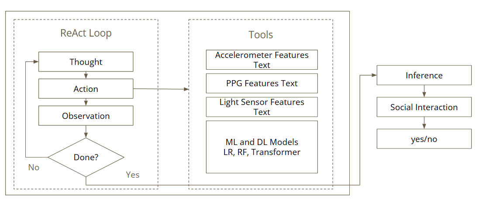

# Agentic AI-Based Social Interaction Detection from Smartwatch Sensors

## Motivation

Social interaction is an important sign of well-being. Regular positive contact can improve mood and make daily life feel more meaningful. In contrast, withdrawal and avoidance often appear alongside anxiety and depression. If a smartwatch could detect when someone is interacting with others, it could support context-aware systems that respond in real time. It could log patterns, prompt reflection, or deliver light-touch support. This is also useful in clinical research. Passive measures of social engagement are already used as digital phenotypes in studies of depression, post-traumatic stress, and early dementia. A wrist-based detector that works without a microphone would be easier to deploy and easier for participants to accept.

Most earlier work on this task relies on audio. SocialPulse (Ahmed et al., 2026), for example, reports about 90% balanced accuracy by detecting the watch wearer's foreground speech from 15-second audio windows. Audio, however, is the most privacy-sensitive signal on the device. Audio models also use more compute than other watch sensors. Many users are likely to opt out of microphone access, which limits who can benefit from the system. That raises a practical question: how much social-interaction signal remains if we remove the microphone and keep only lower-cost, more privacy-friendly sensors?

This project tests that question. We use only accelerometer, PPG, and ambient light data, and we use only the first 16 seconds of each 90-second window. We compare conventional machine learning, deep learning, large language models, and an agentic ReAct pipeline on the same task. The 16-second limit matches the latency needs of an always-on system that should react during or near a conversation, not long after it ends.

## Methods

We use EMA deployment data from 38 participants (PA01-PA24, PB01-PB18), with 33,727 labeled windows in total. The class split is about 68/32 in favor of "no interaction." The median participant contributes around 850 windows. The smallest contributor (PA11) has 290 windows, and the largest (PB16) has 1,585. Because evaluation uses leave-one-subject-out cross-validation (LOSOCV), models that overfit to individual participants are penalized.

The accelerometer is sampled at about 50 Hz and PPG at about 25 Hz. PPG often has dropouts when optical contact is poor. The light stream is event-triggered rather than fixed-rate, so we summarize it over each window instead of resampling it.

**Features.** For each 16-second window, we extract 107 hand-crafted features. These include time-domain statistics and zero crossings from the accelerometer axes, cross-axis correlations, band-power and other spectral features, HRV features from PPG computed with NeuroKit2, and log-scale summaries of the light channel. The PPG feature set focuses on HRV measures that still work reasonably well on short, noisy segments, such as RMSSD, SDNN, pNN50, LF/HF power, and sample entropy. We also avoid features that could reveal subject identity, such as long-term resting heart rate offsets.

**Models.** We compare four model families on the same windows:

1. *Classical ML* - Logistic Regression, Random Forest, and XGBoost trained on the 107 features. Each model is retrained inside every LOSO fold. Hyperparameters stay fixed across folds.
2. *Deep learning* - TCN, LSTM, and a small 1D Transformer encoder trained directly on the raw multi-channel time series. We use light data augmentation, including random scaling and time shift, to reduce subject memorization.
3. *LLM zero/few-shot* - Llama-3.2-3B, Qwen2.5-7B, and OLMo-1B prompted with natural-language descriptions of per-modality features. The prompt format is the same across models so performance differences are more likely to reflect the models rather than the wording.
4. *Agentic ReAct* - A GPT-4o-mini agent that can call up to three of four tools for each sample: `lr_predict`, `rf_predict`, `transformer_predict`, and `get_light_text`. The agent decides when to stop and make a prediction. The ML tools are retrained inside every LOSO fold. The Transformer output is precomputed per fold and then looked up. The agent sees only tool outputs, not raw features, so it works by combining model predictions rather than reclassifying the sample itself. The overall ReAct control loop is illustrated in Figure 1.

*Figure 1. ReAct agent loop used to combine per-modality predictors before making a final decision.*

**Evaluation.** We use leave-one-subject-out cross-validation throughout. No subject appears in both train and test within a fold. We macro-average metrics across the 38 folds, and we also track per-fold variation because the cohort is small enough that averages can hide important differences between subjects.

## Evaluation

The results across all 38 LOSO-CV folds are shown below. Because the classes are imbalanced, balanced accuracy is the most useful summary metric.

| Family | Best model | Balanced Accuracy | F1 |
|---|---|---|---|
| Classical ML | Logistic Regression | 0.5561 | 0.4714 |
| Deep learning | Transformer | 0.5506 | 0.4736 |
| LLM | Llama-3.2-3B | 0.5479 | 0.6244 |
| Agentic | **ReAct (LR + RF + Transformer + Light)** | **0.5695** | **0.4918** |

Several patterns stand out. ReAct has the best balanced accuracy, but it only beats plain Logistic Regression by about 1.3 points. The deep models tend to overpredict the positive class. TCN and LSTM both reach recall above 0.91, but their precision is close to 0.34, which suggests collapse rather than useful discrimination. The LLM-based light agents produce the highest F1 scores because they predict the positive class aggressively, but their balanced accuracy stays below the classical baselines. Model size is not a clear advantage among the LLMs. The 1B OLMo model performs about the same as the 7B Qwen model. That suggests the main issue is calibration in an unfamiliar sensor domain, not raw model capacity.

Variation across held-out subjects is also important. ReAct reaches 0.71 balanced accuracy on the best fold (PA09 held out), but falls to 0.46 on the worst fold (PB04), which is below chance. A small group of subjects, especially PA02, PA17, and PB07, drives a large share of the errors across every model family. Their data includes long phone calls with little motion and shared meals where the watch arm stays mostly still. Those situations look too similar to the sedentary negative class.

Overall, every approach falls into a narrow band between 0.51 and 0.57 balanced accuracy. That is better than random, but far below the roughly 0.90 reported for SocialPulse with audio. The gap fits the basic intuition: speech is a direct cue for interaction, while motion and physiology provide only weak indirect cues.

## Conclusions

The main takeaway is simple: 16 seconds of accelerometer, PPG, and light data provide only a weak signal for social interaction when the model must generalize to a new person. Most of the variation in these sensors comes from differences between people, such as resting heart rate, workspace conditions, and how they wear or move their wrist. A 16-second window is usually too short to smooth those differences out. Longer windows or a short per-subject enrollment step would likely help, but both would change the deployment tradeoff.

Within that limit, the ranking makes sense. Hand-crafted features plus Logistic Regression are still hard to beat. The signal that does exist seems to be captured mostly by simple linear structure in the right features. Bigger deep models do not help much. The dataset is small for their capacity, and LOSO-CV punishes any subject-specific shortcuts they learn. The LLMs are interesting, but they are poorly calibrated. They can talk fluently about light and motion descriptions, but they lean too often toward the positive class. That is an important warning for anyone using off-the-shelf LLMs as zero-shot sensor classifiers.

The ReAct pipeline performs best, but the gain is modest. It does not add new information. Instead, it combines existing predictors and decides which tool to trust for a given sample. The agent traces suggest a sensible pattern: it leans on the Transformer when PPG looks noisy, on Random Forest when accelerometer band-power features are in the middle range, and on the light tool to break ties in evening windows. It also stops early in about 41% of cases, which helps control tool-call cost. The improvement over Logistic Regression is small but consistent, which suggests that meta-reasoning over several weak predictors is worth exploring even when none of them is strong on its own.

The best next steps are not bigger models but better signal. Useful directions include longer windows, light per-subject calibration, sensor-language pretraining that captures the structure of accelerometer and PPG data, and a distilled local controller that can run the ReAct policy on-device without an API round trip. None of these changes the core result: audio-free social interaction detection is difficult. Still, each one targets a specific bottleneck seen in the results above.
